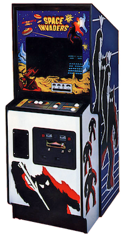
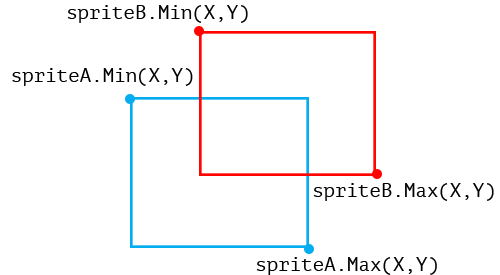
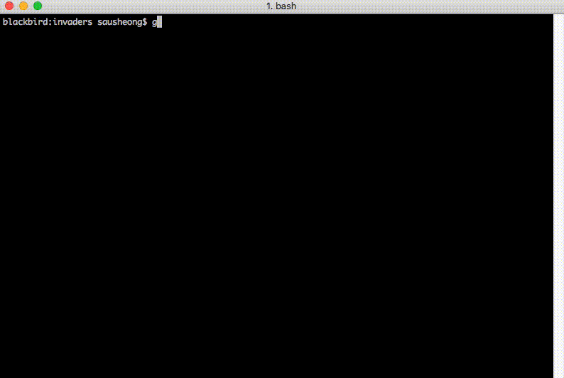

# Writing Space Invaders with Go

The earliest memory I had of arcade video games was watching my older brother and cousins going at the video game machines at Genting Highlands. While our parents were at the other types of games Genting Highlands was more popularly known for, we were generally let loose to play arcade games to our hearts' content. 

Those were the magical days of Pac-Man, Space Invaders, Galaxian, Donkey Kong, Frogger, Centipede and many, many more. Days of blinking lights, intense music, frantic tugs at the joystick, furious mashing of the buttons then the groans of dismay as the last life was lost. 

As with many aspiring programmers starting out, one of my secret dreams was always to recreate that magic, to write the next big game. And as with many as well programmers, I failed many times miserably. Even though eventually I succeeded in writing some simple games, I came to realise that even seemingly simple games are in fact not easy to write.

Of course that didn't stop me from trying my hand at it once again. This time round I tried the grand old dame of arcade video games -- _Space Invaders_.

## Space Invaders

[Space Invaders](https://en.wikipedia.org/wiki/Space_Invaders) was one of the most successful arcade video games during the [golden age of arcade video games](https://en.wikipedia.org/wiki/Golden_age_of_arcade_video_games). It was first released in 1978 and is generally accepted as start of the golden age, which lasted from late 70s to the early 90s. Even after the decline of arcade video games, it simply transcended the medium and moved to video game consoles.



The premise of the game, in case you're not already familiar, is quite simple. As the player you control a laser cannon to battle rows of alien invaders. The laser cannon can only move horizontally across the bottom of the screen as the aliens move back and forth, and slowly descending upon you. The aliens try to destroy you by dropping torpedos at you, while you are partially protected by a few stationary defending bunkers. The game ends if the aliens reach the cannon or all your cannons are destroyed.

As I said, simple. 

## Engine-less

Most game development uses some sort of game engine or at least a graphics engine, but the game I wrote uses neither. Instead what I tried to do is to build a game by creating individual frames and displaying them rapidly one after another. Essentially, this is a variation of the [flocking simulation](https://sausheong.github.io/posts/flocking-with-go/) I wrote earlier. 

The idea is quite straightforward -- a while back I stumbled on a [hack](https://www.iterm2.com/documentation-images.html) in iTerm2 that allows me to display images on the screen and that led me, one thing to another, displaying a number of images one after another, resulting in an animation.

Which, if you think about it, is what a simple game like Space Invaders is all about -- an animation that can be controlled by a user.

Let's look at the code.

## Sprites

In computer graphics, sprites are independent objects that are added on to a background. Sprites were, not unexpectedly, first used in arcade video games and were often generated by hardware. In our case, we're using a simple but popular technique of using a single sprite sheet and taking various parts of the sprite sheet to be a separate sprite.


The image above is a magnified version of the `sprites.png` sprite sheet file. 

```go
// sprites
var src = getImage("imgs/sprites.png")
var background = getImage("imgs/bg.png")
var cannonSprite = image.Rect(20, 47, 38, 59)
var cannonExplode = image.Rect(0, 47, 16, 57)
var alien1Sprite = image.Rect(0, 0, 20, 14)
var alien1aSprite = image.Rect(20, 0, 40, 14)
var alien2Sprite = image.Rect(0, 14, 20, 26)
var alien2aSprite = image.Rect(20, 14, 40, 26)
var alien3Sprite = image.Rect(0, 27, 20, 40)
var alien3aSprite = image.Rect(20, 27, 40, 40)
var alienExplode = image.Rect(0, 60, 16, 68)
var beamSprite = image.Rect(20, 60, 22, 65)
var bombSprite = image.Rect(0, 70, 10, 79)
```
Each sprite is represented by an `image.Rectangle` position of the corresponding sprite image in the `sprites.png` file. For example, the `alien1Sprite` shows a Rectangle with the upper left position of `(0,0)` and the lower right position of `(20,14)`.


We'll see how this is being used in a short while.

We also see that we load up the 2 image files `sprites.png` and `bg.png`. This function simply gets an `image.Image` from an image file.

```go
func getImage(filePath string) image.Image {
	imgFile, err := os.Open(filePath)
	defer imgFile.Close()
	if err != nil {
		fmt.Println("Cannot read file:", err)
	}
	img, _, err := image.Decode(imgFile)
	if err != nil {
		fmt.Println("Cannot decode file:", err)
	}
	return img
}
```

Now that we have the positions of the sprites, let's see the `Sprite` struct itself.

```go
// Sprite represents a sprite in the game
type Sprite struct {
	size     image.Rectangle // the sprite size
	Filter   *gift.GIFT      // normal filter used to draw the sprite
	FilterA  *gift.GIFT      // alternate filter used to draw the sprite
	FilterE  *gift.GIFT      // exploded filter used to draw the sprite
	Position image.Point     // top left position of the sprite
	Status   bool            // alive or dead
	Points   int             // number of points if destroyed
}
```

The sprites are represented by:

1. The size of the sprite, which is the Rectangle we defined earlier
2. 3 images filters which we will later use for drawing the sprites
3. The position of the sprite to draw on the background
4. A representation of the status of the sprite, and 
5. The number of points if the sprite is destroyed (this is only applicable for aliens).

The image filters we are using are from the excellent [Go Image Filtering Toolkit (GIFT)](https://github.com/disintegration/gift). We are underutilising this library since we're only using this to draw the sprite on the background. Each sprite has 3 filters, a normal filter for drawing a normal sprite, an alternate filter, which draws an alternate form of the sprite (only for aliens, so far) and an exploded filter, which draws the sprite when it's exploded (or died). We're using the alternate form of the sprite to animate the sprite.

Let's look at the definition of different sprites in the game.

```go
var aliens = []Sprite{}

// sprite for laser cannon
var laserCannon = Sprite{
	size:     cannonSprite,
	Filter:   gift.New(gift.Crop(cannonSprite)),
	Position: image.Pt(50, 250),
	Status:   true,
}

// sprite for the laser beam
var beam = Sprite{
	size:     beamSprite,
	Filter:   gift.New(gift.Crop(beamSprite)),
	Position: image.Pt(laserCannon.Position.X+7, 250),
	Status:   false,
}
```

This is a simplified version of Space Invaders, so we only have 4 types of sprites -- aliens, the bombs the aliens drop, the laser cannon, and the laser beam that shoots out of the cannon. The variable `aliens` is an array of alien sprites, `bombs` is an array of bombs dropped while `laserCannon` is the laser cannon sprite and `beam` is the laser beam sprite. As you can see from the code, the filter crops the part of the sprite sheet according to the defined Rectangle earlier.

We're not creating the aliens yet here, but we'll need to in a while, which we will be using a function:

```go
// used for creating alien sprites
func createAlien(x, y int, sprite, alt image.Rectangle, points int) (s Sprite) {
	s = Sprite{
		size:     sprite,
		Filter:   gift.New(gift.Crop(sprite)),
		FilterA:  gift.New(gift.Crop(alt)),
		FilterE:  gift.New(gift.Crop(alienExplode)),
		Position: image.Pt(x, y),
		Status:   true,
		Points:   points,
	}
	return
}
```

We wil be passing the Rectangles to the function to create the correct alien sprite and it's alternate form (for animating the sprite) but all aliens explode the same way. Bombs are created in the game loop itself and we'll see it later.

So much for the sprites, let's look at the `main` function of the game.

## The action starts

This is a game that starts from the terminal, and the whole game is animated on the terminal. Therefore, controlling the terminal is very important. I used the popular [termbox-go](https://github.com/nsf/termbox-go) library to give me this control. Termbox, as with the GIFT library, is probably an overkill since it's a much more powerful library than is needed here.

```go
err := termbox.Init()
if err != nil {
	panic(err)
}
```

I start off the main function by initializing termbox-go. The game actually has 2 independent loops:

* The first is the control of the laser cannon by the user and this is through input on the keyboard (left and right arrows)
* The second is the rest of the game, in what is called a game loop, explained later. This runs regardless of whatever the user does. It includes continual movement of the aliens as they descend while dropping bombs to destroy all life on earth as well as the upward movement of the laser beam as it hurtles towards the aliens to blast them to bits.

This means there are 2 concurrently running threads, and in this case, goroutines.

```go
// poll for keyboard events in another goroutine
events := make(chan termbox.Event, 1000)
go func() {
	for {
		events <- termbox.PollEvent()
	}
}()
```

We start a separate goroutine that polls for events and stuffs them into a buffered channel. We're using a liberally large buffer here, it can really be smaller, but the larger the buffer, the relatively smoother the event captures are so I didn't really try to figure out the optimal size.

Most games have a start screen, where you are asked to place credits to press a button to begin. We have one too.

```go
	// show the start screen
	startScreen := getImage("imgs/start.png")
	printImage(startScreen)
start:
	for {
		switch ev := termbox.PollEvent(); ev.Type {
		case termbox.EventKey:
			if ev.Ch == 's' || ev.Ch == 'S' {
				break start
			}
			if ev.Ch == 'q' {
				gameOver = true
				break start
			}
		}
	}
```

We're polling the keyboard again, and we're waiting for some to either press the `s` or `S` to begin the game, or `q` to quit the game.

Next, we populate the `aliens` array. This is pretty straightforward, we simply want 3 rows of different aliens.

```go
// populate the aliens
for i := aliensStartCol; i < aliensStartCol+(alienSize*aliensPerRow); i += alienSize {
	aliens = append(aliens, createAlien(i, 30, alien1Sprite, alien1aSprite, 30))
}
for i := aliensStartCol; i < aliensStartCol+(30*aliensPerRow); i += alienSize {
	aliens = append(aliens, createAlien(i, 55, alien2Sprite, alien2aSprite, 20))
}
for i := aliensStartCol; i < aliensStartCol+(30*aliensPerRow); i += alienSize {
	aliens = append(aliens, createAlien(i, 80, alien3Sprite, alien3aSprite, 10))
}
```

## Game loop

Now that we've laid the groundwork, let's get into the main game loop. Most games run in a what is commonly called a [game loop](http://gameprogrammingpatterns.com/game-loop.html). A game loop is a game software development pattern that is often the heart of a game. It's an infinite loop that updates and redraws to animate gameplay. In our Space Invaders game loop we use a variable named `gameOver` to indicate that the loop should continue until the game ends (either triggered by the player or when the aliens win).

The game loop is rather long so we'll break it up into a few parts. Let's look at the first part, which is used to capture the keyboard events from the player.


```go
// if any of the keyboard events are captured
select {
case ev := <-events:
	if ev.Type == termbox.EventKey {
		if ev.Key == termbox.KeyCtrlQ {
			gameOver = true
		}
		if ev.Key == termbox.KeySpace {
			if beam.Status == false {
				beamShot = true
			}
		}
		if ev.Key == termbox.KeyArrowRight {
			laserCannon.Position.X += 10
		}
		if ev.Key == termbox.KeyArrowLeft {
			laserCannon.Position.X -= 10
		}
	}

default:

}
```

Whenever the `events` buffered channel has something, it will be received into the `ev` variable where we try to determine what kind of event it is. Pressing `Ctrl-Q` ends the game, while pressing the space bar fires a laser beam. Pressing the left or right arrow buttons move the laser cannon left or right accordingly. 

You might notice that we have to have a default in the select. This is because if we don't have the default, the select will block, and the loop can only proceed whenever the user presses a key!

Next, we'll draw the laser cannon and alien sprites. We start off with an empty image and drawing the background on to it.

```go
// create background
dst := image.NewRGBA(image.Rect(0, 0, windowWidth, windowHeight))
gift.New().Draw(dst, background)
```

## Aliens are coming!

We start off with the aliens first.

```go
// process aliens
for i := 0; i < len(aliens); i++ {
	aliens[i].Position.X = aliens[i].Position.X + 5*alienDirection
	if aliens[i].Status {
		// if alien is hit by a laser beam
		if collide(aliens[i], beam) {
			// draw the explosion
			aliens[i].FilterE.DrawAt(dst, src, image.Pt(aliens[i].Position.X, aliens[i].Position.Y), gift.OverOperator)
			// alien dies, player scores points
			aliens[i].Status = false
			score += aliens[i].Points
			// reset the laser beam
			resetBeam()
		} else {
			// show alternating alients
			if loop%2 == 0 {
				aliens[i].Filter.DrawAt(dst, src, image.Pt(aliens[i].Position.X, aliens[i].Position.Y), gift.OverOperator)
			} else {
				aliens[i].FilterA.DrawAt(dst, src, image.Pt(aliens[i].Position.X, aliens[i].Position.Y), gift.OverOperator)
			}
			// drop torpedoes
			if rand.Float64() < bombProbability {
				dropBomb(aliens[i])
			}			
		}
	}
}
```

To determine where the aliens should be going, we multiply the horizontal (X) position of the alien with the variable `alienDirection`. 

We also use the `Status` of the alien to determine if it's alive or dead. If it's alive, we check if it has collided with a laser beam. If yes, it's dead. We draw the explosion sprite, set the `Status` to false, rack up the player points and reset the laser beam. Reseting the laser beam just means we set the beam's `Status` back to `false` and place it at the vertical (Y) level the same as the cannon.

```go
func resetBeam() {
	beam.Status = false
	beam.Position.Y = 250
}
```

## Collision physics

If the alien didn't collide with the laser beam, we display either the normal sprite or the alternate sprite. This gives us the animation of a moving alien.

Let's take a quick look at the collision physics, which is concentrated in the `collide()` function.

```go
func collide(s1, s2 Sprite) bool {
	spriteA := image.Rect(s1.Position.X, s1.Position.Y, s1.Position.X+s1.size.Dx(), s1.Position.Y+s1.size.Dy())
	spriteB := image.Rect(s2.Position.X, s2.Position.Y, s2.Position.X+s1.size.Dx(), s2.Position.Y+s1.size.Dy())
	if spriteA.Min.X < spriteB.Max.X && spriteA.Max.X > spriteB.Min.X &&
		spriteA.Min.Y < spriteB.Max.Y && spriteA.Max.Y > spriteB.Min.Y {
		return true
	}
	return false
}
```

Give the two sprites are boxed within the two rectangles, the sprites are considered to have collided if all these conditions are met:

*  spriteA.Min.X < spriteB.Max.X
*  spriteA.Max.X > spriteB.Min.X
*  spriteA.Min.Y < spriteB.Max.Y
*  spriteA.Max.Y > spriteB.Min.Y



## Bombs away

The aliens drop bombs as they descend on the laser cannon. Obviously we don't want it to drop bombs continually, so we use a probability to determine if the bomb should be dropped or not.

```go
// drop torpedoes
if rand.Float64() < bombProbability {
	dropBomb(aliens[i])
}	
```

Dropping a bomb here means we create a new `Bomb` sprite and set it to start at where the alien is located, then adding it to the array of bombs.

```go
func dropBomb(alien Sprite) {
	torpedo := Sprite{
		size:     bombSprite,
		Filter:   gift.New(gift.Crop(bombSprite)),
		Position: image.Pt(alien.Position.X+7, alien.Position.Y),
		Status:   true,
	}

	bombs = append(bombs, torpedo)
}
```

Now that we have drawn the aliens (or its death by explosion), we check if it has moved outside of the window. It it has, we reverse the direction and move the aliens down.

```go
// move the aliens back and forth
if aliens[0].Position.X < alienSize || aliens[aliensPerRow-1].Position.X > windowWidth-(2*alienSize) {
	alienDirection = alienDirection * -1
	for i := 0; i < len(aliens); i++ {
		aliens[i].Position.Y = aliens[i].Position.Y + 10
	}
}
```

We also need to move the bombs downwards on its deadly descend, according to the `bombSpeed`.

```go
// draw bombs, if laser cannon is hit, game over
for i := 0; i < len(bombs); i++ {
	bombs[i].Position.Y = bombs[i].Position.Y + bombSpeed
	bombs[i].Filter.DrawAt(dst, src, image.Pt(bombs[i].Position.X, bombs[i].Position.Y), gift.OverOperator)
	if collide(bombs[i], laserCannon) {
		gameOver = true
		laserCannon.FilterE.DrawAt(dst, src, image.Pt(laserCannon.Position.X, laserCannon.Position.Y), gift.OverOperator)
	}
}
```
As the bombs drop, we need to check if it collides with the laser cannon. If it did, it's game over, and we draw the exploding cannon sprite.

That's it for the aliens and their bombs in the game loop. Let's look at the laser cannon and its laser beam next. 

## Laser cannon and beams

The laser cannon is relatively simple. We continue drawing the cannon as long as it's not been destroyed.

```go
// draw the laser cannon unless it's been destroyed
if !gameOver {
	laserCannon.Filter.DrawAt(dst, src, image.Pt(laserCannon.Position.X, laserCannon.Position.Y), gift.OverOperator)
}
```

As for the laser beam, since there is only one variable to represent it you'd probably realise that the cannon can only shoot one laser beam at a time. This is mostly for simplicity's sake.

We use the `beamShot` variable to determine if the player has pressed the space bar, and therefore shot the laser cannon. 

```go
// if the beam is shot, place the beam at start of the cannon
if beamShot {
	beam.Position.X = laserCannon.Position.X + 7
	beam.Status = true
	beamShot = false
}
```

If yes, we place the beam at the tip of the laser cannon, set the beam's `Status` to `true` to indicate that the beam is in action and we should show it, then set `beamShot` back to false.

We need to check the beam's `Status` and if it's in action, we draw it and then move it up. If the beam's position is outside the window, we reset the beam again.

```go
// keep drawing the beam as it moves every loop
if beam.Status {
	beam.Filter.DrawAt(dst, src, image.Pt(beam.Position.X, beam.Position.Y), gift.OverOperator)
	beam.Position.Y -= 10
}

// if the beam leaves the window reset it
if beam.Position.Y < 0 {
	resetBeam()
}
```

# Wrapping up and printing the image

Just before we end the game loop, we print the image to the screen, print the score and increment the loop.

```go
printImage(dst)
fmt.Println("\n\nSCORE:", score)
loop++
```
So how _exactly_ do we print the image on the screen? This is done through a simple hack on ITerm2 (so this only works on iTerm2, sorry!)

```go
// this only works for iTerm2!
func printImage(img image.Image) {
	var buf bytes.Buffer
	png.Encode(&buf, img)
	imgBase64Str := base64.StdEncoding.EncodeToString(buf.Bytes())
	fmt.Printf("\x1b[2;0H\x1b]1337;File=inline=1:%s\a", imgBase64Str)
}
```

And that's it! All in all, including comments, the code is less than 300 lines. If it seems pretty short, you should remember the original entire compiled binary ROM for the game is less than 110kb in size, including images and music! And mine is a simpler clone without the full game features (multiple lives, defender bunkers, ufo etc) and also includes 2 external libraries.

This is how it looks on my computer. How does it look on yours?



# Code

The code for this is all here in this GitHub repository.

https://github.com/sausheong/invaders

